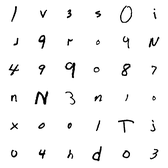

# (Differentially Private) Federated Generative Adversarial Networks

This directory contains source code for reproducing the differentially private
federated GAN results presented in the paper
[Generative Models for Effective ML on Private, Decentralized Datasets](https://arxiv.org/abs/1911.06679).

Some pip packages are required by this library, and may need to be installed:

```
pip install absl-py
pip install attr
pip install dm-tree
pip install numpy
pip install Pillow
pip install tensorboard
pip install tensorflow
pip install tensorflow-federated
pip install tensorflow-gan
pip install tensorflow-privacy
```

## Scenario

We wish to debug a 'primary' ML model deployed for inference inside a mobile
app. The example presented in the paper is a classifier converting handwriting
(images) to numbers/letters, used for reading checks in a bank app. The data is
private and decentralized, as it resides on the app's users' mobile phones. We
use the
[federated EMNIST dataset](https://www.tensorflow.org/federated/api_docs/python/tff/simulation/datasets/emnist)
to model the user data.

### EMNIST Classifier (aka the 'primary' model)

The classifier network is defined as a Keras model in the
`experiments/emnist/classifier:emnist_classifier_model` library. The library
provides a pretrained Keras model instance (which we used in all experiments).
If desiring to retrain an EMNIST classifier from scratch, build and run the
`experiments/emnist/classifier:train_emnist_classifier_model` script.

### Bug: Pixel Intensity Inversion (Black <-> White Flip)

An application update unwittingly introduces a bug: upstream of the classifier
network, the pixels of the handwriting images are being 'inverted' (i.e., black
and white are flipped). Here are example images without the bug (this is Figure
2a in the paper) ...


... and with the bug (this is Figure 2b in the paper) ...



This bug affects a fraction of the overall users (i.e., the fraction of the user
population that has updated the app to latest version). For users that have
updated, all of their data is inverted. The impact of this bug on classification
accuracy can be observed by running the
`experiments/emnist/classifier:measure_misclassification_of_users` script.

## Federated GAN (aka the 'auxiliary' model)

Federated GANs can be trained to reproduce data examples of either just the
normal data or just the buggy data. We can then identify the bug by
comparing/contrasting the generated content of a GAN reproducing normal data and
a GAN reproducing buggy data.

### Preprocessing - Filtering the users/examples

As the user data is non-inspectable, and we don't know *a priori* that the bug
is correlated with app version, we have no way of exactly separating 'normal'
from 'buggy'. Rather, we'll approximate by filtering data based on something
that should reasonably correlate with absence/presence of the bug. The code here
supports two manners of such filtering.

The first is `by_user`: a user accuracy threshold is chosen, and all users with
EMNIST classification accuracy above the threshold are considered to have data
that is 'normal'. Similarly, another user accuracy threshold can be chosen and
all users with accuracy below the threshold are considered to have data that is
'buggy'. This is the manner of filtering done in the body of the paper (Section
6).

The second is `by_example`: all examples that classify correctly are considered
to be 'normal', and all examples that misclassify are considered to be 'buggy'.
(Results with this manner of filtering are presented in the Appendix.)

We run scripts which apply the bug to a given percentage of users, and then form
a set of users/examples either by filtering `by_user` or `by_example`. To save
computation time when running repeated experiments, we save the results of this
filtering in csv files, so that a given experiment can simply load which users
are in a training population (if filtered `by_user`) or load which examples for
each user are part of the training set (if `by_example`).

The `experiments/emnist/preprocessing:filtered_emnist_data_utils` library
provides utilities for accessing the precomputed filtered data. If desiring to
redo the pre-computation (and write new csv files), build and run the
`experiments/emnist/preprocessing:filter_users` script and/or the
`experiments/emnist/preprocessing:filter_examples` script.

### Training

The `experiments/emnist:train` script trains a federated GAN on EMNIST data.
Flags to this script identify the subset of data to train on (either filtered
`by_user`, `by_example`, or not filtered), the training hyperparameters
(including differential privacy hyperparameters that control clipping/noising),
and how often to save off model checkpoints or generated images.

To regenerate the results from Section 6 of the
[paper](https://arxiv.org/abs/1911.06679), run the
`experiments/emnist:run_experiments` script. Otherwise, you can run the
`experiments/emnist:train` script to alter hyperparameters and further explore
the training space (e.g., to run experiments where the data is filtered
`by_example` instead).

### Results

These images are representative output from the generator of a GAN trained on
the highest accuracy users (i.e., users generally unaffected by bug), after
training for 1000 rounds...


... and these images are representative output from the generator of a GAN
trained on the lowest accuracy users (i.e., users generally affected by the
bug), after training for 1000 rounds:


(These images are shown in Figure 3 in the paper.)
